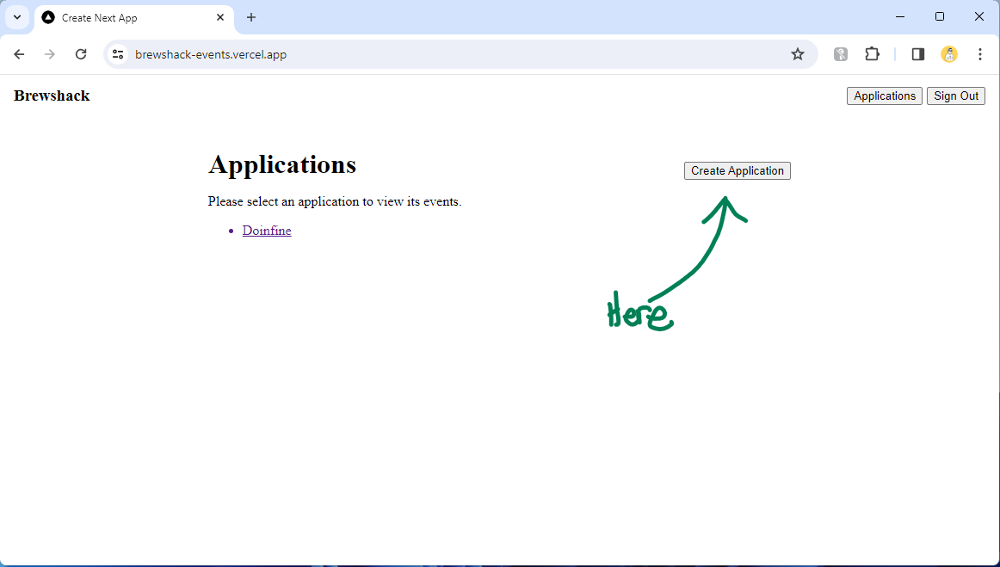
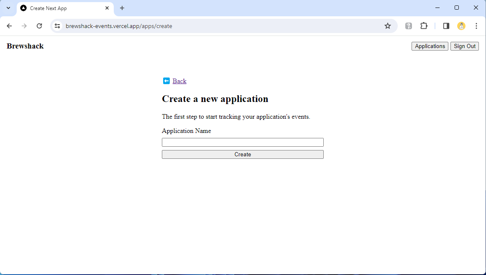
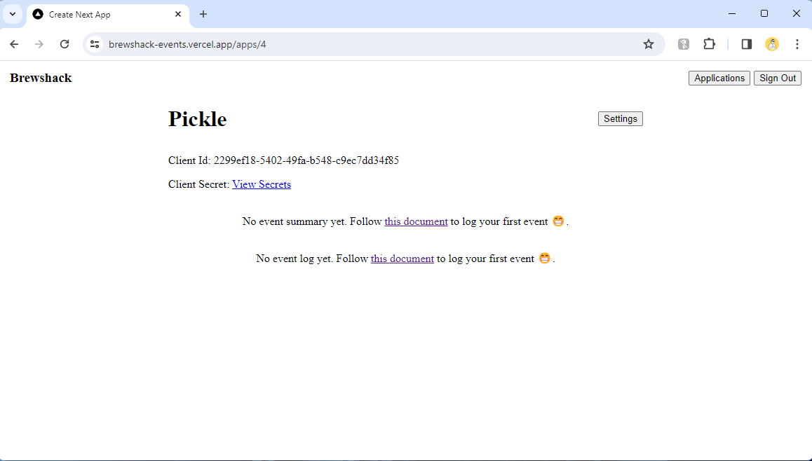

# Creating an application

An application represents your project, whether it be a mobile app or a web app. Any data related to your project is stored under the application, for example events.

## Step 1: Click on Create Application

## Step 2: Enter new application name

## Step 3: View application details

